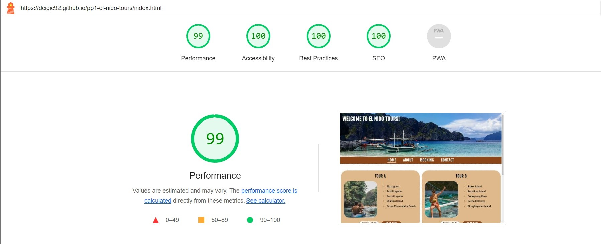
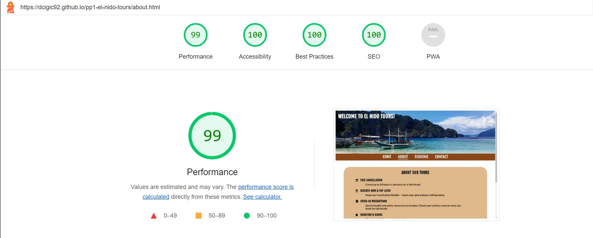
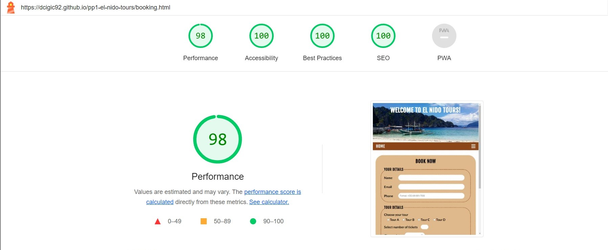
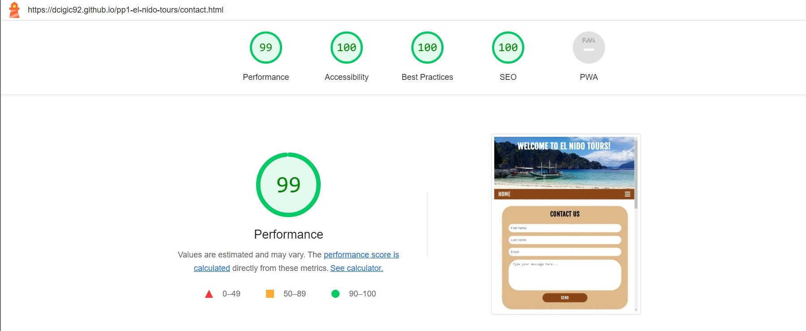
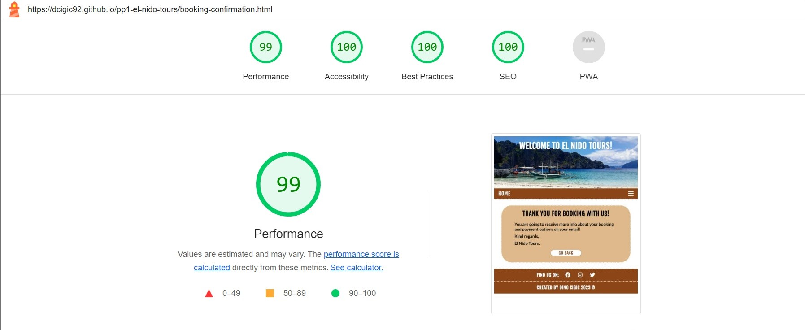

# El Nido Tours

**A website created for a fictional tour agency inspired by real tours in El Nido, Philippines.**

***[Live website](https://dcigic92.github.io/pp1-el-nido-tours/index.html)*** created by **Dino Cigic**.

***

## Contents

- [Technologies Used](#technologies-used)
- [Testing](#testing)
    - [Manual testing](#manual-testing)
    - [CSS Validation](#css-validation)
    - [HTML Validation](#html-validation)
    - [Google Lighthouse](#google-lighthouse)
- [Deployment](#deployment)
- [Credits](#credits)
    - [Images](#images)
    - [Content](#images)
    - [Code](#code)
- [Acknowledgements](#acknowledgements)

## Technologies Used
- HTML
- CSS
- Javascript
- Git
- Github
- Visual Studio Code
- W3Schools
- Stack Overflow
- Chrome DevTools
- Google fonts
- Google maps
- Font Awesome
- Favicon.io
- Convertio.co

## Testing

### Manual testing

- User testing
    - Tested by 3 persons to get some general feedback.

- Devices
    - Tested on 5 different devices.

- Browsers
    - Tested in Google Chrome, Firefox and Microsoft Edge.

- Responsiveness
    - Tested on all available devices in Chrome DevTools.

### CSS Validation
CSS code was validated with the W3C Jigsaw CSS Validation Service and no errors found.

    

### HTML Validation
HTML code of each page was validated with the W3C Markup Validation Service and no errors found.
- [index.html](https://validator.w3.org/nu/?doc=https%3A%2F%2Fdcigic92.github.io%2Fpp1-el-nido-tours%2Findex.html)
- [about.html](https://validator.w3.org/nu/?doc=https%3A%2F%2Fdcigic92.github.io%2Fpp1-el-nido-tours%2Fabout.html)
- [booking.html](https://validator.w3.org/nu/?doc=https%3A%2F%2Fdcigic92.github.io%2Fpp1-el-nido-tours%2Fbooking.html)
- [contact.html](https://validator.w3.org/nu/?doc=https%3A%2F%2Fdcigic92.github.io%2Fpp1-el-nido-tours%2Fcontact.html)
- [booking-confirmation.html](https://validator.w3.org/nu/?doc=https%3A%2F%2Fdcigic92.github.io%2Fpp1-el-nido-tours%2Fbooking-confirmation.html)
- [contact-confirmation.html](https://validator.w3.org/nu/?doc=https%3A%2F%2Fdcigic92.github.io%2Fpp1-el-nido-tours%2Fcontact-confirmation.html)

### Google Lighthouse

- index.html

- about.html

- booking.html

- contact.html

- booking-confirmation.html

- contact-confirmation.html

## Deployment
- To deploy the website I used GitHub pages and followed these steps:
    1. Open your *repository*.
    2. Click on *settings* in the *navigation menu*.
    3. Under *code and automation* choose *pages*.
    4. Select the *main branch* and *save*.
    5. Refresh a few times and the link to your website should appear shortly.

## Credits

### Images 

- [Unsplash](https://unsplash.com/)
    - [Photo](https://unsplash.com/photos/xmw-2dMRH3Y) by [Ehmir Bautista](https://unsplash.com/es/@ehmirbautista) - Header image
    - [Photo](https://unsplash.com/photos/qXcl3z7_AOc) by [Adam Navarro](https://unsplash.com/ko/@adamnavarro_) - Tour A image
    - [Photo](https://unsplash.com/photos/JcLgfW2pccc) by [Rona Lao](https://unsplash.com/es/@ronalao) - Tour B image
    - [Photo](https://unsplash.com/photos/is-iq9wqMWw) by [Cris Tagupa](https://unsplash.com/es/@cjtagupa) - Tour C image
    - [Photo](https://unsplash.com/photos/DvyEkhT3RUU) by [Toa Heftiba](https://unsplash.com/@heftiba) - Tour D image

- [Flaticon](https://www.flaticon.com/)
    - [Image](https://www.flaticon.com/free-icon/island_4617266) by [smashicons](https://www.flaticon.com/authors/smashicons) - favicon

### Content

- A lot of text taken from [GetYourGuide](https://www.getyourguide.com/) and edited
    - [Tour A](https://www.getyourguide.com/el-nido-l974/el-nido-island-hopping-tour-a-lagoons-and-beaches-t217227/)
    - [Tour B](https://www.getyourguide.com/el-nido-l974/el-nido-island-hopping-tour-b-cudognong-cave-more-t228373/)
    - [Tour C](https://www.getyourguide.com/hidden-beach-l104676/el-nido-island-hopping-tour-c-hidden-beaches-shrine-t219591/)
    - [Tour D](https://www.getyourguide.com/el-nido-l974/el-nido-hidden-beaches-and-lagoons-boat-hopping-tour-d-t229222/)

- All icons for the footer, about page and contact page were taken from [Font Awesome](https://fontawesome.com/).

### Code

- HTML, CSS and JavaScript code for the menu for small screen sizes was copied from [here](https://www.w3schools.com/howto/tryit.asp?filename=tryhow_js_topnav) and modified.
- How to display an unordered list in two columns found [here](https://stackoverflow.com/questions/14745297/how-to-display-an-unordered-list-in-two-columns).
- Snook’s variant of using rem for font sizing found [here](https://www.sitepoint.com/understanding-and-using-rem-units-in-css/).

## Acknowledgements

I would like to thank my mentor **Akshat Garg** for his feedback and valuable advice.