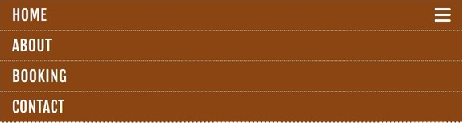
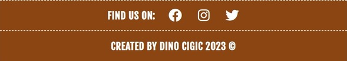
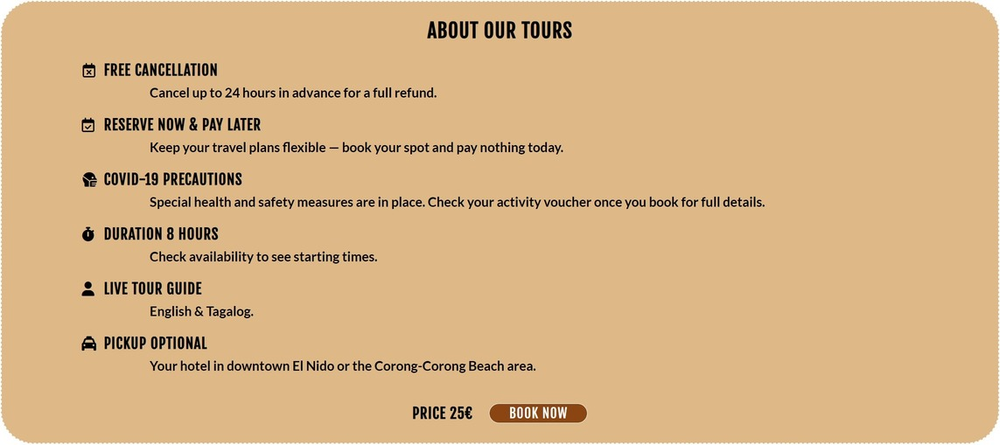
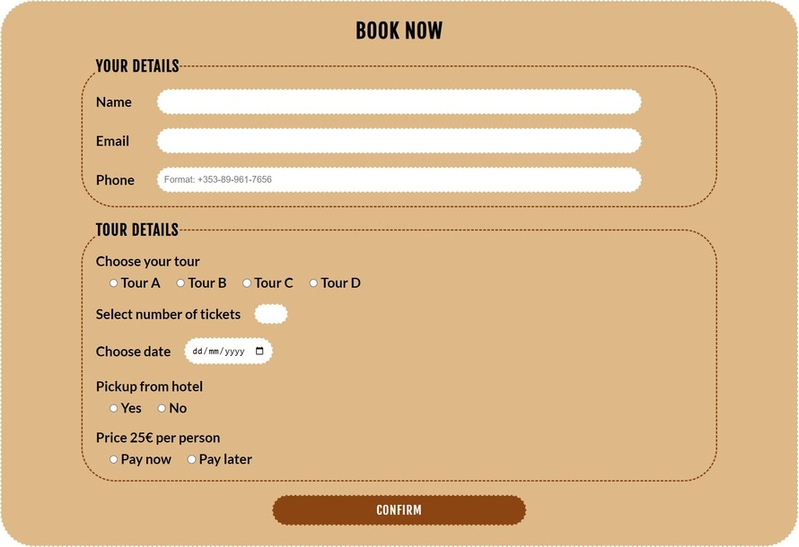
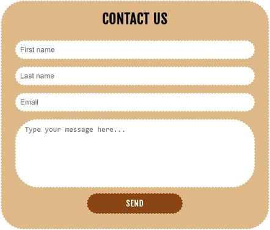
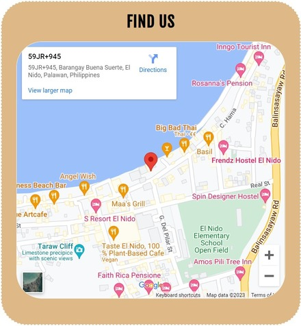
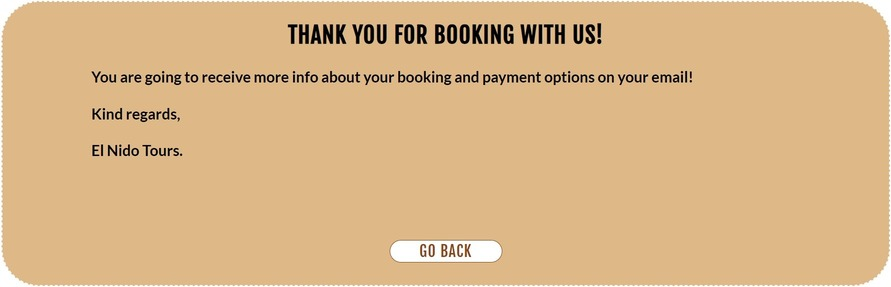

# El Nido Tours

**A website created for a fictional tour agency inspired by real tours in El Nido, Philippines.**

***[Live website](https://dcigic92.github.io/pp1-el-nido-tours/index.html)*** created by **Dino Cigic**.

***

## Contents

- [User experience](#user-experience)
    - [Project goals](#project-goals)
    - [User stories](#user-stories)
- [Design](#design)
    - [Colours](#colours)
    - [Typography](#typography)
    - [Site Structure](#site-structure)
- [Technologies Used](#technologies-used)
- [Features](#features)
    - [Header](#header)
    - [Navigation](#navigation)
    - [Main content](#main-content)
    - [Footer](#footer)
    - [About page content](#about-page-content)
    - [Booking page content](#booking-page-content)
    - [Contact page content](#contact-page-content)
    - [Confirmation pages](#confirmation-pages)
    - [Features left to implement](#features-left-to-implement)
- [Testing](#testing)
    - [Manual testing](#manual-testing)
    - [CSS Validation](#css-validation)
    - [HTML Validation](#html-validation)
    - [Google Lighthouse](#google-lighthouse)
    - [Resolved bugs/issues](#resolved-bugsissues)
    - [Unresolved bugs/issues](#unresolved-bugsissues)
- [Deployment](#deployment)
- [Credits](#credits)
    - [Images](#images)
    - [Content](#images)
    - [Code](#code)
- [Acknowledgements](#acknowledgements)

***

## User experience

### Project goals
- To create a website which is going to present our tours to our customers and where they can find all the info they might need.
- To eliminate the need for our customers to come to our office until the very beginning of the tour.

### User stories
- As a user, I want to be able to see all the tours and all the attractions that each tour offers.
- As a user, I want to be able to see all the important info about tours before I decide to book my tour.
- As a user, I want to be able to book my tour online.
- As a user, I want to be able to find contact info easily and contact the agency if I have any queries.

## Design

### Colours
Black, white, burlywood and saddlebrown are only colours used in this project.  

### Typography
In this project I used google fonts. *Fjala one* font used for headings and menu, *Lato* font used for the body text.

### Site Structure
The website contains 4 main pages and 2 confirmation pages that are used only as a feedback to the user after submitting booking or contact form.

## Technologies Used
- HTML
- CSS
- Javascript
- [Git](https://git-scm.com/)
- [Github](https://github.com/)
- [Visual Studio Code](https://code.visualstudio.com/)
- [W3Schools](https://www.w3schools.com/)
- [Stack Overflow](https://stackoverflow.com/)
- [Chrome DevTools](https://developer.chrome.com/docs/devtools/)
- [Google fonts](https://fonts.google.com/)
- [Google maps](https://www.google.co.uk/maps/)
- [Font Awesome](https://fontawesome.com/)
- [Favicon.io](https://favicon.io/)
- [Convertio.co](https://convertio.co/)
- [Coolors.co](https://coolors.co/)
- [Image Resizer](https://imageresizer.com/)

## Features

### Header 
- consists of main heading/logo and background photo taken on one of our tours.
- header is on the top of each page.

### Navigation
- includes links to the *Home*, *About*, *Booking* and *Contact* pages.
- navigation is fully responsive and for smaller screen sizes it turns into a "hamburger menu".

Large screens navigation

Smaller screens navigation  

### Main content
- consists of 4 sections (different tour options).
- each section has a photo taken on our tour, list of attractions and 2 buttons one with a link to the about page and second with a link to the booking page.
- it's fully responsive and changing structure few times depending on the screen size.

Large screens main content

Medium screens main content  

Small screens main content  

Very small screens main content  

### Footer
- consists of copyright text and social icons.
- its responsive and for smaller screen sizes copyright text goes under the social icons.

Large screens footer

Smaller screens footer  

### About page content
- all the important info about our tours
- button with link to the booking page

### Booking page content
- booking form to book your tour.

### Contact page content
- consists of 3 sections: 
    - *Contact us* is a simple form for the user to send us a message.
    - *Contact info* has all the important info.
    - *Find us* has google map with our location.

Contact us  

Contact details  

Find us  

### Confirmation pages
- one page for confirming booking and second page for confirming contact message.

Booking confirmation  

Contact confirmation  

### Features left to implement
- 404 page
- One page for each tour

## Testing

### Manual testing

- User testing
    - Tested by 3 persons to get some general feedback.

- Devices
    - Tested on 5 different devices.

- Browsers
    - Tested in Google Chrome, Firefox and Microsoft Edge.

- Responsiveness
    - Tested on all available devices in Chrome DevTools.

### CSS Validation
CSS code was validated with the W3C Jigsaw CSS Validation Service and no errors found.

    

### HTML Validation
HTML code of each page was validated with the W3C Markup Validation Service and no errors found.
- [index.html](https://validator.w3.org/nu/?doc=https%3A%2F%2Fdcigic92.github.io%2Fpp1-el-nido-tours%2Findex.html)
- [about.html](https://validator.w3.org/nu/?doc=https%3A%2F%2Fdcigic92.github.io%2Fpp1-el-nido-tours%2Fabout.html)
- [booking.html](https://validator.w3.org/nu/?doc=https%3A%2F%2Fdcigic92.github.io%2Fpp1-el-nido-tours%2Fbooking.html)
- [contact.html](https://validator.w3.org/nu/?doc=https%3A%2F%2Fdcigic92.github.io%2Fpp1-el-nido-tours%2Fcontact.html)
- [booking-confirmation.html](https://validator.w3.org/nu/?doc=https%3A%2F%2Fdcigic92.github.io%2Fpp1-el-nido-tours%2Fbooking-confirmation.html)
- [contact-confirmation.html](https://validator.w3.org/nu/?doc=https%3A%2F%2Fdcigic92.github.io%2Fpp1-el-nido-tours%2Fcontact-confirmation.html)

### Google Lighthouse

- index.html

- about.html

- booking.html

- contact.html

- booking-confirmation.html

- contact-confirmation.html

### Resolved bugs/issues

- Html code for the menu for small screen sizes which I took from other website (mentioned in the credits) was causing bad SEO performance so I modified it. Icon for the menu was inside anchor element which had *href* attribute with *"javascript:void(0);"* as a value, I replaced anchor element with span element and kept only *onclick* attribute.

- Button *more info* was causing bad SEO performance so had to rename it to *about tours* to get better performance even though I prefered first option.

- Confirmation pages were not covering full screen on some devices, header, main content and footer together with margins didn't have enough height so on some screens there was white space under the footer. I had to put fixed height for main content to be sure to cover whole screen for every device even though I would prefer it without fixed height.

### Unresolved bugs/issues

- It is possible to choose dates in the booking form that have already passed. Can't fix that with the HTML and CSS only.

## Deployment

To deploy the website I used GitHub pages and followed these steps:

1. Open your *repository*.
2. Click on *settings* in the *navigation menu*.
3. Under *code and automation* choose *pages*.
4. Select the *main branch* and *save*.
5. Refresh a few times and the link to your website should appear shortly.

## Credits

### Images 

- [Unsplash](https://unsplash.com/)
    - [Photo](https://unsplash.com/photos/xmw-2dMRH3Y) by [Ehmir Bautista](https://unsplash.com/es/@ehmirbautista) - Header image
    - [Photo](https://unsplash.com/photos/qXcl3z7_AOc) by [Adam Navarro](https://unsplash.com/ko/@adamnavarro_) - Tour A image
    - [Photo](https://unsplash.com/photos/JcLgfW2pccc) by [Rona Lao](https://unsplash.com/es/@ronalao) - Tour B image
    - [Photo](https://unsplash.com/photos/is-iq9wqMWw) by [Cris Tagupa](https://unsplash.com/es/@cjtagupa) - Tour C image
    - [Photo](https://unsplash.com/photos/DvyEkhT3RUU) by [Toa Heftiba](https://unsplash.com/@heftiba) - Tour D image

- [Flaticon](https://www.flaticon.com/)
    - [Image](https://www.flaticon.com/free-icon/island_4617266) by [smashicons](https://www.flaticon.com/authors/smashicons) - favicon

- [Coolors.co](https://coolors.co/) - Used to create pallete image for the readme file.

### Content

- A lot of text taken from [GetYourGuide](https://www.getyourguide.com/) and edited
    - [Tour A](https://www.getyourguide.com/el-nido-l974/el-nido-island-hopping-tour-a-lagoons-and-beaches-t217227/)
    - [Tour B](https://www.getyourguide.com/el-nido-l974/el-nido-island-hopping-tour-b-cudognong-cave-more-t228373/)
    - [Tour C](https://www.getyourguide.com/hidden-beach-l104676/el-nido-island-hopping-tour-c-hidden-beaches-shrine-t219591/)
    - [Tour D](https://www.getyourguide.com/el-nido-l974/el-nido-hidden-beaches-and-lagoons-boat-hopping-tour-d-t229222/)

- All icons for the footer, about page and contact page were taken from [Font Awesome](https://fontawesome.com/).

### Code

- HTML, CSS and JavaScript code for the menu for small screen sizes was copied from [here](https://www.w3schools.com/howto/tryit.asp?filename=tryhow_js_topnav) and modified.
- How to display an unordered list in two columns found [here](https://stackoverflow.com/questions/14745297/how-to-display-an-unordered-list-in-two-columns).
- Snook’s variant of using rem for font sizing found [here](https://www.sitepoint.com/understanding-and-using-rem-units-in-css/).

## Acknowledgements

- I would like to thank my mentor **Akshat Garg** for his feedback and valuable advice.
- I would also like to thank **Alan Bushell** our cohort facilitator and slack community, especially former students whose projects were inspiration for writing readme file.